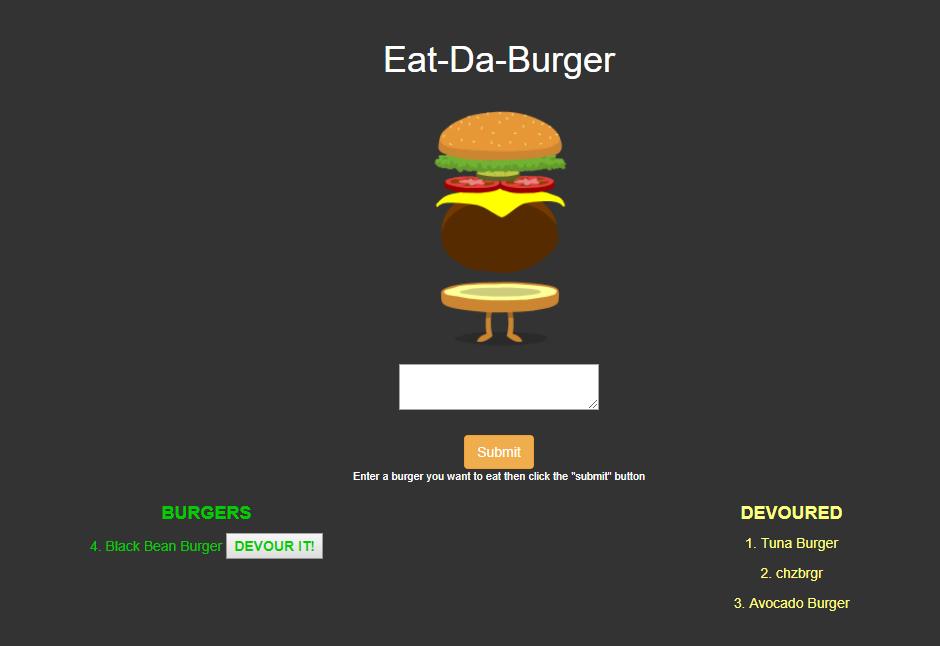

# Eat-Da-Burger 
### Created burger logger with MySQL, Node, Express, Handlebars, ORM and includes MVC design pattern.

App lets user input names of burgers they'd like to eat. "Devour It" button is displayed along with the submitted burger in Burgers.

When "Devour It" button clicked, burger moves to Devoured.

App stores every burger in database, devoured or not.
